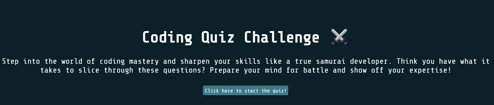

# code-quiz-webpage

## Description

This project is a webpage that quizzes the user on basic Javascript! It logs the user's scores as well and runs a timer during the quiz duration. Enjoy and let me know your high score!

## Installation

No install required! This is simply a webpage. 

## Usage

Access the webpage here:

To add a screenshot, create an assets/images folder in your repository and upload your screenshot to it. Then, using the relative file path, add it to your README using the following syntax:

## Credits

Columbia Coding Bootcamp

I would also like to thank W3schools for the help. :)

## License

MIT License

## How to Contribute

See the [Contributor Covenant](https://www.contributor-covenant.org/)!
